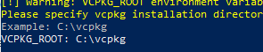
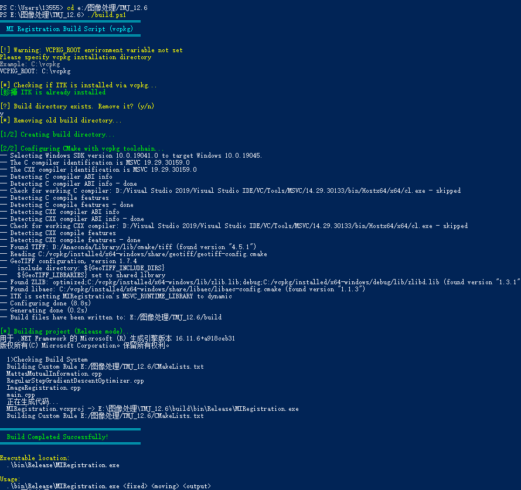
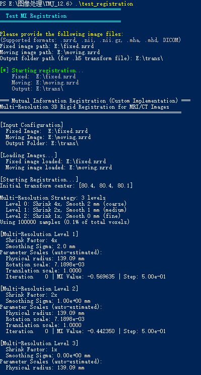

打开PowerShell
- 进入vcpkg所在文件夹，我这里是C:\vcpkg
`cd C:\`
`cd vcpkg`
- 下载itk库
`.\vcpkg install itk:x64-windows`
- 进入工程文件夹，这下边有辅助构建和编译的build.ps1文件。我这里是e:\图像处理\TMJ_12.6
`cd e:\图像处理\TMJ_12.6`
- 运行辅助构建和编译的build.ps1文件（其实可以不用前面的操作，直接运行这个文件一颗）
`.\build.ps1`
- 会让输入vcppkg所在目录（我的是C:\vcpkg）
  
- 如果已有构建文件夹（build）,会询问是否删除，一般选y
  
- 构建并生成可执行文件的话会显示Build Completed Successfully!
- 之后运行测试文件
`.\test_registration`
- 之后输入固定图像、浮动图像、输出文件夹的路径
目前不支持中文路径，比如下面是输入格式
```
Fixed image path:  E:\MRHead.nrrd
Moving image path:  E:\MRHead_trans.nrrd
Output image path:  E:\trans\MRHead.nrrd
```
- 运行结束会产生Registration Completed!字样
完整过程如下：  

  
